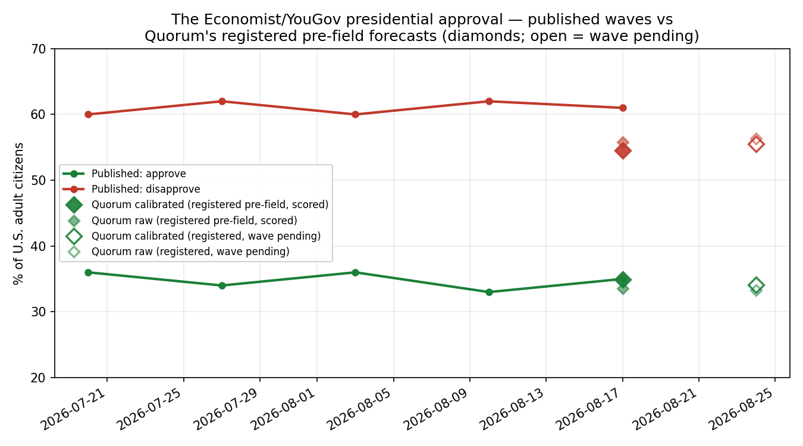

# Quorum — Forward Tests

Public, timestamped forecasts of public opinion surveys, **registered before the survey is
fielded**, scored against the published result, and reported whether they pass or fail.

Quorum is a simulated-population engine: it estimates how a population would answer a
question, using an open-weight language model conditioned on real demographic frames. The
only way to know whether such a thing works is to make it commit in advance, in public.
That is what this repository is for.

**Running tally: 8 of 8 registered pass/fail claims hit.** A miss, when it comes, appears
here at the same prominence. One scored wave is one wave: a quarter of registered
forecasts (weekly waves, a second polling house, 40+ scored quantities) runs before any
broader claim is made.

*The series so far: published waves (lines) against every registered forecast (diamonds —
filled = scored, open = wave pending; large = calibrated engine, small = raw). The chart
shows the misses too: our disapprove runs visibly low (the "Not sure" over-hedge named in
the verdict). Data + sources: [`tracking.csv`](tracking.csv); one row appends per wave.*

---

## Scoreboard

One row per engine per wave; rows are appended as waves register and score, newest last.
Every verdict links to the frozen protocol carrying its arithmetic.

### The Economist/YouGov — presidential approval · weekly

| Wave (fielded) | Registered | Engine | Result | Verdict | Detail |
|---|---|---|---|---|---|
| Aug 14–17, 2026 | Aug 13, pre-field | raw | 3/3 bars (topline −1.4 · net +3.8 · 9-cell 4.14) | **PASS** | [protocol + verdict](forward-test-1.md) |
| Aug 14–17, 2026 | Aug 13, pre-field | calibrated | 4/4 bars (topline −0.1 · party MAE 7.23) + head-to-head upheld | **PASS** | [protocol + verdict](forward-test-1b.md) |
| ~Aug 21–24, 2026 (awaiting field) | Aug 17, pre-field | raw + calibrated | bars declared | *pending* | [protocol](forward-test-2.md) |

### Gallup — satisfaction with the way things are going · monthly

| Poll (fields) | Registered | Engine | Result | Verdict | Detail |
|---|---|---|---|---|---|
| September 2026 (~Sept 1–19) | *registration due before fielding* | raw + calibrated | — | *upcoming* | — |

### Coming next — each gated on the published entry rule

A question family enters this scoreboard only after passing a validation diagnostic on
real per-person data (correct party ordering and adequate discrimination), and the rule
is applied before any forecast is made — families that fail are named, not skipped
silently (economic evaluation currently fails it and is excluded).

- **Direction of country** and the **generic House ballot** (same weekly poll) — entry
  diagnostics scheduled; added only on a pass.
- **Trump favorability** (same weekly poll) — candidate, diagnostic scheduled.
- **The November 3, 2026 midterm** — a registered national House-margin forecast before
  Election Day, turnout assumptions disclosed at registration.
- **Consumer sentiment** — currently excluded (economic family); enters only if a
  published in-family repair passes its own pre-declared test.

---

## Latest scored wave, in full

Published poll: *Economist*/YouGov, fielded August 14–17 2026, n = 1,611
([toplines](https://d3nkl3psvxxpe9.cloudfront.net/documents/econtoplines_8q3E3LQ.pdf) ·
[crosstabs](https://d3nkl3psvxxpe9.cloudfront.net/documents/econTabReport_jNjXIL6.pdf),
table 31). Every cell we forecast, against what the poll printed — errors shown so nobody
has to compute them:

| Quantity | Published | FT1-B calibrated (err) | FT1 raw (err) |
|---|---|---|---|
| **Approve** | **35.0** | **34.9 (−0.1)** | 33.6 (−1.4) |
| Disapprove | 61.0 | 54.5 (−6.5) | 55.8 (−5.2) |
| Not sure | 3.0 | 10.6 (+7.6) | 10.6 (+7.6) |
| **Net** | **−26** | **−19.7 (+6.3)** | −22.2 (+3.8) |
| Men | 39 | 41.2 (+2.2) | 36.0 (−3.0) |
| Women | 32 | 29.1 (−2.9) | 31.4 (−0.6) |
| Age 18–29 | 30 | 31.3 (+1.3) | 32.3 (+2.3) |
| Age 30–44 | 27 | 34.0 (+7.0) | 33.3 (+6.3) |
| Age 45–64 | 40 | 37.3 (−2.7) | 34.4 (−5.6) |
| Age 65+ | 43 | 36.9 (−6.1) | 34.3 (−8.7) |
| White | 39 | 40.6 (+1.6) | 35.6 (−3.4) |
| Black | 22 | 17.1 (−4.9) | 27.2 (+5.2) |
| Hispanic | 34 | 29.6 (−4.4) | 31.8 (−2.2) |
| Democrats | 4 | **9.8 (+5.8)** | 24.1 (+20.1) |
| Independents | 21 | **27.3 (+6.3)** | 31.4 (+10.4) |
| Republicans | 80 | **70.4 (−9.6)** | 46.3 (−33.7) |

Bars (declared before fielding; averages, so single cells above may exceed them):
topline ±5 → **0.1 / 1.4**, both pass · net ±8 → **6.3 / 3.8**, both pass ·
sex/age/race 9-cell MAE ≤ 6 → **3.68 / 4.14**, both pass · party MAE ≤ 12, registered
for the calibrated engine only → **7.23**, pass (raw party was published unregistered
and missed by 21.4 — that gap is what the calibration exists to fix, and the
head-to-head claim that it would was itself registered, and upheld).

Read the verdict's fine print in `forward-test-1.md`, including two things we surface
ourselves: the engine over-predicts "Not sure" (10.6 vs 3), and simply copying the
previous week's poll is a strong naive baseline on topline and net (persistence:
2.0 / 3.0) — a benchmark that exists only for questions already polled weekly, which is
why an already-polled question is the proving ground and not the product.

---

## Registration record — frozen artifacts

Everything below is the registration history, immutable once committed: hashes live in
`SHA256SUMS`, corrections appear as new dated files, never edits. (This README is the
living front page and is excluded from `SHA256SUMS`.)

## Forward Test 1 — the registration, as frozen 2026-08-13 2026-08-13

**Target:** the next *Economist*/YouGov weekly poll to begin fielding after the registration
timestamp (expected on or about 14–17 August 2026), presidential job approval question:

> "Do you approve or disapprove of the way Donald Trump is handling his job as President?"

**Registered forecast** (U.S. adult citizens):

| Quantity | Forecast |
|---|---|
| **Approve** | **33.6%** |
| **Disapprove** | **55.8%** |
| **Net** | **−22.2** |
| Not sure | 10.6% |

Registered subgroup approve shares:

| Cut | Forecast |
|---|---|
| Male / Female | 36.0 / 31.4 |
| Age 18–29 / 30–44 / 45–64 / 65+ | 32.3 / 33.3 / 34.4 / 34.3 |
| White / Black / Hispanic | 35.6 / 27.2 / 31.8 |

Also published, **explicitly not registered** (see the protocol's disclosure): party-ID
cuts — Dem 24.1, Ind 31.4, Rep 46.3. A pre-registration dry run showed the method's
party-conditional spread is compressed relative to any published wave; rather than quietly
drop the weakness, we publish it unregistered and name it as the next thing to fix.

**Declared success bars** (set before the result exists): topline approve error ≤ 5 points;
net error ≤ 8 points; mean absolute error across the 9 registered subgroup cells ≤ 6 points.

**Method, in one paragraph:** ~3,200 distinct demographic profiles drawn from Pew Research
Center's American Trends Panel Wave 161 (February 2025) microdata, carrying Pew's survey
weights; each profile is put to the poll's exact question wording by a fine-tuned
open-weight model, which returns a probability distribution over the five answer options;
the distributions are weight-averaged into a topline and crosstabs. The prompt includes one
paragraph of era context (`anchor-2026-08-13.txt`) containing **no polling numbers**. No
2026 polling data enters the model, the prompt, or any calibration step. The method's only
calibration anchor is a February 2025 validation in which it recovered the published Pew
approval topline within ±5 points.

**Files**

| File | What it is |
|---|---|
| `forward-test-1.md` | the full protocol as registered, including limitations |
| `forecast-ft1.json` | the frozen forecast, with the era anchor and its hash inside |
| `anchor-2026-08-13.txt` | the era-context paragraph given to the model |
| `SHA256SUMS` | hashes of all three |

**Registration mechanism.** This repository *is* the registration. The three registered
artifacts — `forward-test-1.md`, `forecast-ft1.json`, `anchor-2026-08-13.txt` — are
immutable once committed: their hashes in `SHA256SUMS` will never change, and any
correction appears as a new dated file rather than an edit. (This README is the living
front page and is excluded from `SHA256SUMS` for that reason.)

**How to verify us:** the commit that added the registered artifacts is timestamped by
GitHub and predates the target poll's field dates. Check `SHA256SUMS` against the files; check the
field dates on the published *Economist*/YouGov toplines; then compare the numbers above to
what the poll actually reported. When it publishes, the verdict — pass or fail, with the
arithmetic — is appended to `forward-test-1.md` in this repository.

---

## Forward Test 1-B — companion, registered the same day (calibrated)

Forward Test 1's protocol disclosed that the engine's party-conditional spread is
compressed. Investigating that — using only 2019 and 2025 gold data, none from 2026 — found
that the engine *ranks* respondents well (AUC 0.896 against real per-person answers) while
its *probabilities* are systematically compressed, and that a two-parameter monotone
calibration corrects it: held-out party error 20.25 → 5.63 points, and the same correction
transports to a different survey from a different era with no refitting.

FT1-B registers that correction as a falsifiable prediction **on the same poll**, so one
published result adjudicates the uncorrected and corrected engine. **Forward Test 1 is
unchanged and will be scored exactly as registered** — its file and hash are untouched.

| Cut | FT1 (raw) | FT1-B (calibrated) |
|---|---|---|
| Approve / Disapprove / Net | 33.6 / 55.8 / −22.2 | **34.9 / 54.5 / −19.7** |
| Party: Dem / Ind / Rep | 24.1 / 31.4 / 46.3 | **9.8 / 27.3 / 70.4** |
| Sex: Male / Female | 36.0 / 31.4 | **41.2 / 29.1** |
| Age: 18-29 / 30-44 / 45-64 / 65+ | 32.3 / 33.3 / 34.4 / 34.3 | **31.3 / 34.0 / 37.3 / 36.9** |
| Race: White / Black / Hispanic | 35.6 / 27.2 / 31.8 | **40.6 / 17.1 / 29.6** |

The registered claim: FT1-B's party error beats FT1's, and lands within 12 points. Details,
bars, and the full disclosure are in `forward-test-1b.md`; the forecast is
`forecast-ft1b.json`.

---

## Forward Test 2 — registered 2026-08-17 (pending)

Same frozen method, same bars, next wave: raw (FT2) and calibrated (FT2-B) forecasts of
the first *Economist*/YouGov poll to begin fielding after the registration push, expected
to field on or about August 21–24, 2026. Fresh dated era anchor
(`anchor-2026-08-17.txt`, no polling numbers), hashes in `SHA256SUMS`. Protocol and
forecasts: `forward-test-2.md`, `forecast-ft2.json`, `forecast-ft2b.json`.

---

## What is not here

The model, adapters, and harness source are not published; the panel microdata is not
redistributed (its licence forbids that). This repository is the *commitment record*: what
we predicted, when we predicted it, and how it scored.

## Attribution

Population frame derived from Pew Research Center's American Trends Panel, Wave 161. Pew
Research Center bears no responsibility for the analyses or interpretations here.
