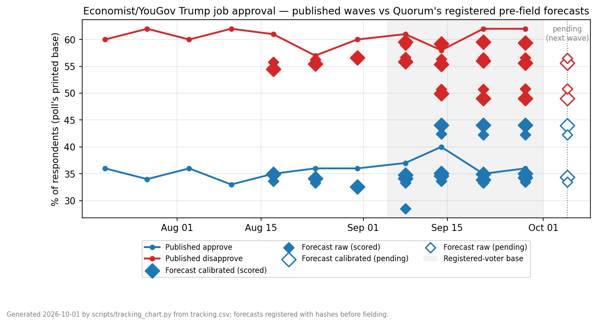

# Quorum — Forward Tests

Public, timestamped forecasts of public opinion surveys, **registered before the survey is
fielded**, scored against the published result, and reported whether they pass or fail.

Quorum is a simulated-population engine: it estimates how a population would answer a
question, using an open-weight language model conditioned on real demographic frames. The
only way to know whether such a thing works is to make it commit in advance, in public.
That is what this repository is for.

**Running tally: 50 of 56 core registered claims hit across seven scored waves
(FT1 8/8 · FT2 8/8 · FT3 7/8 · FT4 7/8 · FT5 5/8 · FT6 7/8 · FT7 8/8).** Misses: the raw engine's
9-cell bar on four straight waves (FT3–6; it passed on FT7), and, on the Sep 11–14 wave, when
approval rose 3 points in a week, both engines' toplines (raw −6.4, calibrated −5.4 against ±5).
On the Sep 25–28 wave approval rose 1 point to 36, and the 14B passed every core bar. The phi-4
challenger lost all three registered head-to-heads for the second week running (party 10.9 vs
8.0; topline 8.1 vs 1.7; net 21.1 vs 4.7). The same quiet week favoured last week's poll carried
forward: it beat every arm on topline, net, party and subgroups. Neither engine's level moves;
the 14B passes when the wave sits near it. The arithmetic is in
[`verdict-ft7-2026-10-01.md`](verdict-ft7-2026-10-01.md). A second polling house scored
for the first time on Sep 26–28: Harvard CAPS/Harris HH1 hit 5 of 8 as registered, and its
calibrated companion passed 3 of 3 ([`hh1/verdict-hh1-2026-10-01.md`](hh1/verdict-hh1-2026-10-01.md)). One scored wave is one wave: a quarter
of registered forecasts (weekly waves, a second polling house, 40+ scored quantities) runs
before any broader claim is made.

**Per-test verdict record: [`TRACK-RECORD.md`](TRACK-RECORD.md)** — one entry per forward test, regenerated from the register, never hand-edited.

*The series so far: published waves (lines) against every registered forecast (diamonds —
filled = scored, open = wave pending; large = calibrated engine, small = raw; shaded weeks
printed on a registered-voter base, earlier weeks on adult citizens). The chart
shows the misses too: our disapprove runs visibly low (the "Not sure" over-hedge named in
the verdict). Data + sources: [`tracking.csv`](tracking.csv); one row appends per wave.*

---

## What we have found out about our own engine (published 19 Aug 2026, before Forward Test 2 scores)

We run diagnostics on our own method and publish what they find, including when the
finding weakens a result we have already reported. This one does.

**The engine's absolute level is a fixed prior. It does not respond to the era.** We put
twelve mechanically-built, date-only context anchors to the frozen engine, spanning
February 2017 to August 2026 — a period over which real presidential approval moved
between 34% and 49%. The engine returned **29.7% to 33.2%** for every one of them. The
slope of our prediction against the published truth is **+0.004** (r = +0.023): about
four hundredths of a point of movement for every point reality moved. It never exceeded
33.2%, even against anchors whose true value was 49%. The flatness holds equally for
dates inside the model's training data and dates after it, so this is not a memory
limitation — it is a fixed prior.

**What that means for Forward Test 1, which passed.** Its topline pass was substantially
a coincidence: the published figure was 35.0%, our engine's constant sits near 32%, and
the context facts plus the calibration lifted it to 34.9%. Had the identical registered
method been aimed at the December 2025 wave, it would have predicted roughly 35% against
a published 41% — a six-point miss and a failed bar. **We do not forecast movement, and
no absolute level from this engine should be trusted without an external anchor.**

**What is not affected.** The party-structure result stands: raw party error of 21.4
points versus 7.23 for the calibrated engine is a *difference between two engines on
identical inputs*, which no shared level prior can manufacture. Per-respondent
discrimination (AUC 0.896 against real individual answers) is likewise independent of
level.

**What we are doing about it.** The registered series continues unchanged — the frozen
method is the record, and altering it after seeing a result would defeat the purpose.
Alongside it we are building a two-stage engine of the kind survey statisticians already
use for this exact problem: the model supplies the conditional structure it is genuinely
good at, and a small amount of real data supplies the level. Future registrations will
also carry a **movement bar** — predicting the change from the previous published wave,
which a fixed prior cannot fake.

Evidence: twelve-anchor sweep, 19 August 2026. We publish this before Forward Test 2 is
scored rather than after, so it cannot be mistaken for an explanation of a result we have
already seen.

---

## Scoreboard

One row per engine per wave; rows are appended as waves register and score, newest last.
Every verdict links to the frozen protocol carrying its arithmetic.

### The Economist/YouGov — presidential approval · weekly

| Wave (fielded) | Registered | Engine | Result | Verdict | Detail |
|---|---|---|---|---|---|
| Aug 14–17, 2026 | Aug 13, pre-field | raw | 3/3 bars (topline −1.4 · net +3.8 · 9-cell 4.14) | **PASS** | [protocol + verdict](forward-test-1.md) |
| Aug 14–17, 2026 | Aug 13, pre-field | calibrated | 4/4 bars (topline −0.1 · party MAE 7.23) + head-to-head upheld | **PASS** | [protocol + verdict](forward-test-1b.md) |
| Aug 21–24, 2026 | Aug 17, pre-field | raw | 3/3 bars (topline −2.7 · net −2.0 · 9-cell 5.2) | **PASS** | [protocol + verdict](forward-test-2.md) |
| Aug 21–24, 2026 | Aug 17, pre-field | calibrated | 4/4 bars (topline −1.9 · party MAE 9.0) + head-to-head upheld | **PASS** | [protocol + verdict](forward-test-2.md) |
| Aug 28–31, 2026 | Aug 26, pre-field | raw | 2/3 bars (topline −3.4 · net +0.1 · **9-cell 6.31 > 6**) | **FAIL** | [protocol + verdict](forward-test-3.md) |
| Aug 28–31, 2026 | Aug 26, pre-field | calibrated | 4/4 bars (topline −3.4 · party MAE 8.8) + head-to-head upheld; structure bar lost to persistence and movement bar failed, both as registered | **PASS** | [protocol + verdict](forward-test-3.md) |
| Sep 4–8, 2026 (RV base — frame change, disclosed) | Sep 2, pre-field (`e4a0bd0`) | raw | 2/3 bars (topline −3.7 · net +0.6 · **9-cell 6.63 > 6**) | **FAIL** | [verdict](verdict-ft4-2026-09-10.md) · [protocol](ft4/ft4-registration.md) |
| Sep 4–8, 2026 | Sep 2, pre-field | calibrated | 4/4 bars (topline −2.9 · 9-cell 4.36 · party MAE 8.9) + head-to-head upheld; movement bar passed | **PASS** | [verdict](verdict-ft4-2026-09-10.md) |
| Sep 4–8, 2026 | Sep 2, pre-field | raw+dk (C) · no-anchor (D) · direction (E) · ballot (F) | C: dk head-to-head UPHELD (NS 8.0→3.6), 9-cell miss · D: expected topline FAIL met (−8.5) · E: 0/4 as disclosed · F: cal margin −1.1 + party 6.8 hit, D-share −4.3 miss | measurements, reported | [verdict](verdict-ft4-2026-09-10.md) |
| Sep 11–14, 2026 (RV base; approval +3 on the week) | Sep 6, pre-field (`6855b4b`) | 14B raw | 0/3 bars (**topline −6.4** · net −4.9 · **9-cell 6.59**) | **FAIL** | [verdict](verdict-ft5-2026-09-16.md) · [protocol](ft5/ft5-registration.md) |
| Sep 11–14, 2026 | Sep 6, pre-field | 14B calibrated | 3/4 bars (**topline −5.4 > 5** · net −2.8 · 9-cell 4.28 · party 8.0) + head-to-head upheld — first calibrated miss | **FAIL** | [verdict](verdict-ft5-2026-09-16.md) |
| Sep 11–14, 2026 | Sep 6, pre-field | **phi-4 challenger** raw · calibrated | raw 2/3 (topline +2.4 · **net +9.7** · 9-cell 4.23); cal 3/4 (topline +4.1 · **net +13.2** · 9-cell 5.40 · party **7.2**) — **head-to-head 3 UPHELD (7.2 < 8.0), head-to-head 4 UPHELD (4.1 < 5.4)**; beat persistence on structure (1.59 vs 2.78) | **FAIL / FAIL — challenger wins both head-to-heads** | [verdict](verdict-ft5-2026-09-16.md) |
| Sep 11–14, 2026 | Sep 6, pre-field | raw+dk (C) · no-anchor (D) · direction (E) · ballot (F) | **C PASS 3/3, dk head-to-head UPHELD** · D expected FAIL met (−11.4) · E 0/4 (Platt arm retired) · F cal margin +0.2 + party 7.5 hit, D-share −6.7 miss | measurements | [verdict](verdict-ft5-2026-09-16.md) |
| Sep 18–21, 2026 (RV base; approval −5 on the week) | Sep 16, pre-field (`64f8ef2`) | 14B raw | 2/3 bars (topline −1.7 · net +3.7 · **9-cell 6.80 > 6**) | **FAIL** | [verdict](verdict-ft6-2026-09-24.md) · [protocol](ft6/ft6-registration.md) |
| Sep 18–21, 2026 | Sep 16, pre-field | 14B calibrated | 4/4 bars (topline −1.1 · net +4.9 · 9-cell 4.12 · party 9.7) + head-to-head upheld | **PASS** | [verdict](verdict-ft6-2026-09-24.md) |
| Sep 18–21, 2026 | Sep 16, pre-field | phi-4 challenger raw · calibrated | raw 0/3 (**topline +7.3 · net +18.6 · 9-cell 8.90**); cal 1/4 (**topline +9.1 · net +22.1 · 9-cell 10.00** · party 11.3) — **head-to-heads 3, 4 and 5 all NOT upheld** (the 14B won each) | **FAIL / FAIL** | [verdict](verdict-ft6-2026-09-24.md) |
| Sep 18–21, 2026 | Sep 16, pre-field | raw+dk (C) · no-anchor (D) · direction_dk (E) · ballot (F) | C 2/3 (9-cell 6.99), dk head-to-head UPHELD · D expected FAIL met (−6.4) · **E direction_dk PASS −3.1** (first direction pass) · F cal margin −3.1 + party 7.4 hit, D-share −7.3 miss | measurements | [verdict](verdict-ft6-2026-09-24.md) |
| Sep 25–28, 2026 (RV base; approval +1 on the week) | Sep 24, pre-field (`7c3965b`) | 14B raw | 3/3 bars (topline −2.5 · net +2.9 · 9-cell 5.61) — first raw 9-cell pass since FT2 | **PASS** | [verdict](verdict-ft7-2026-10-01.md) · [protocol](ft7/ft7-registration.md) |
| Sep 25–28, 2026 | Sep 24, pre-field | 14B calibrated | 4/4 bars (topline −1.7 · net +4.7 · 9-cell 3.39 · party 8.0) + head-to-head upheld; last week's poll carried forward beat it on every quantity | **PASS** | [verdict](verdict-ft7-2026-10-01.md) |
| Sep 25–28, 2026 | Sep 24, pre-field | phi-4 challenger raw · calibrated | raw 0/3 (**topline +6.3 · net +17.5 · 9-cell 7.19**); cal 1/4 (**topline +8.1 · net +21.1 · 9-cell 8.39** · party 10.9) — **head-to-heads 3, 4 and 5 all NOT upheld** (the 14B won each) | **FAIL / FAIL** | [verdict](verdict-ft7-2026-10-01.md) |
| Sep 25–28, 2026 | Sep 24, pre-field | raw+dk (C) · no-anchor (D) · direction_dk (E) · ballot (F) | **C PASS 3/3**, dk head-to-head UPHELD · D expected FAIL met (−7.5) · **E direction_dk PASS −2.9** (second pass) · F cal margin −2.6 + party 8.3 hit, D-share −7.5 miss | measurements | [verdict](verdict-ft7-2026-10-01.md) |
| first wave to field after the FT8 push (expected Oct 2–5) | Sep 29, pre-field (+ YouGov-weighted [measurement companion](ft8/ft8-companion-ygframe.md), Oct 1: 36.2) | FT7's arms unchanged; movement bar C replaced by the **tracking measure** (engine's own change since FT7 vs the poll's change; registered expected FAIL on any wave that moves >3) | approval 33.5 / 34.4 (fifth straight 33–35; engine change since FT7 0.0 / +0.1); phi-4 42.3 / 44.0; direction_dk 24.3 | *pending* | [protocol](ft8/ft8-registration.md) |

### Gallup — satisfaction with the way things are going · monthly

| Poll (fields) | Registered | Engine | Result | Verdict | Detail |
|---|---|---|---|---|---|
| September 2026 (Sept 1–17) | Aug 29, pre-field (`4881748`) | raw + calibrated | published **21** satisfied: raw 35.7 (**+14.7**), calibrated 48.7 (**+27.7**), bar ±5; last month's poll exact (0.0); party claims pending until Gallup publishes party figures | **FAIL / FAIL** (0 of 2 scored, 2 pending) | [verdict](gs1/verdict-gs1-2026-10-02.md) · [protocol](gs1/gallup-satisfaction-registration.md) |

### Harvard CAPS/Harris — approval, right track, generic ballot · roughly monthly

| Poll (fielded) | Registered | Arms | Result | Verdict | Detail |
|---|---|---|---|---|---|
| September 2026 (Sep 26–28, 2,200 RV) | Aug 29, pre-field (`4881748`) | HH1 raw + house-adjusted | **5 of 8**: approve raw −4.7, adjusted +2.5 · net raw −5.8, **adjusted +8.4 miss** · **right track −10.5 miss** · ballot D −3.4 · **adjusted party MAE 14.2 miss** · head-to-head (adjusted beats raw) upheld | **FAIL** | [verdict](hh1/verdict-hh1-2026-10-01.md) · [protocol](hh1/hh1-registration.md) |
| September 2026 | Sep 3, pre-field (`b35d880`) | HH1-B companions | **approval_cal PASS 3/3** (approve 0.0 · net +3.6 · party 1.47) · cal+house 1/3 (+7.2 · +17.9 · 7.67) · direction_dk −4.2 hit · ballot_cal +2.4 hit · head-to-heads 1 and 3 upheld, 2 not upheld (as registered) | companion, reported | [verdict](hh1/verdict-hh1-2026-10-01.md) · [protocol](hh1/hh1b-registration.md) |

### The November 3, 2026 midterm — national House popular-vote margin · the capstone

| Registered | Quantity | Forecast | Bar / head-to-head | Verdict | Detail |
|---|---|---|---|---|---|
| Sep 11, 2026, pre-election | two-party House vote, D − R | **D+8.54** (D 54.27 / R 45.73) | ±3.0 · beats the RealClearPolitics generic-ballot average as of Nov 2 | *scored Dec 2026, when ≥ 99% counted* | [registration](capstone/capstone-registration.md) · [forecast](capstone/forecast-capstone-2026-09-11.json) · [rows](capstone/rows-capstone-2026-09-11.jsonl) |

One number, one bar, scored once. Turnout is a declared 2022-CPS reweight (the table and
its script are in `capstone/`); the anchor-date sensitivity of the number (±1.5) is
disclosed in the registration, not discovered after.

### Coming next — each gated on the published entry rule

A question family enters this scoreboard only after passing a validation diagnostic on
real per-person data (correct party ordering and adequate discrimination), and the rule
is applied before any forecast is made — families that fail are named, not skipped
silently (economic evaluation currently fails it and is excluded).

- **Direction of country** and the **generic House ballot** (same weekly poll) — entry
  diagnostics passed on Nationscape gold (uAUC 0.765 / 0.950, party ordering correct);
  registered in FT4 as measurement arms, with their registration-day weaknesses disclosed.
- **Trump favorability** — diagnostic passed (uAUC 0.831) and calibration frozen; no weekly
  published target in the E/YouGov toplines, so not yet registrable.
- **Consumer sentiment** — currently excluded (economic family); enters only if a
  published in-family repair passes its own pre-declared test.

---

## The engine against simple poll rules

A forecast is only worth something if it beats the obvious rules that need no model. We
score the 14B calibrated arm (B) against three, all computed from published E/YouGov
toplines by `score_ft.py --benchmark-series` (private repo; numbers reproducible from
`tracking.csv`). **Z1** is the last poll published before the registration push, the
honest same-time competitor. **Z2** is the wave just before the target; it is known only at
scoring, because FT2, FT5 and FT8 were pushed before that wave published. **Z3** is the mean
of the last four polls published before the push.

| Registration | Target wave | Published | **14B calibrated (B)** | Z1 last poll known at push | Z2 wave before target | Z3 mean of last 4 known |
|---|---|---|---|---|---|---|
| FT1 | Aug 14–17 | 35 | 34.9 (−0.1) | 33 (−2.0) | 33 (−2.0) | 34.75 (−0.25) |
| FT2 | Aug 21–24 | 36 | 34.1 (−1.9) | 33 (−3.0) | 35 (−1.0) | 34.75 (−1.25) |
| FT3 | Aug 28–31 | 36 | 32.6 (−3.4) | 36 (0.0) | 36 (0.0) | 35 (−1.0) |
| FT4 | Sep 4–8 | 37 | 34.1 (−2.9) | 36 (−1.0) | 36 (−1.0) | 35 (−2.0) |
| FT5 | Sep 11–14 | 40 | 34.6 (−5.4) | 36 (−4.0) | 37 (−3.0) | 35 (−5.0) |
| FT6 | Sep 18–21 | 35 | 33.9 (−1.1) | 40 (+5.0) | 40 (+5.0) | 37.25 (+2.25) |
| FT7 | Sep 25–28 | 36 | 34.3 (−1.7) | 35 (−1.0) | 35 (−1.0) | 37 (+1.0) |
| FT8 | Oct 2–5 (pending) | — | 34.4 | 35 | known at scoring | 37 |
| **Mean abs. error, 7 waves** | | | **2.36** | 2.29 | 1.86 | 1.82 |

**Read plainly: on the approval topline the engine does not beat simple poll rules.** It
beat Z1 in 3 of 7 waves and Z2 and Z3 in 2 of 7. Its mean error (2.36) is level with Z1
(2.29) and behind Z2 (1.86) and Z3 (1.82). The engine wins when the poll has spiked and
falls back toward the engine's fixed level (FT6). It loses when the poll sits above that level
(FT3–FT5). A retrodiction over the 22 waves before FT1 (known answers, frozen pipeline; not in
this repository) put the calibrated engine at 1.59 against Z2's 1.77. Forward, the order has
reversed. Z2 also beat the engine on party error in each of FT4–FT7 (verdict files). The
engine's case therefore rests on what these rules cannot do at all: questions with no recent
poll to carry forward.

**Declared 2026-10-01, before FT8's target begins fielding:** every verdict from FT8 on
reports Z1, Z2 and Z3 beside the engine on the approval topline. FT8's Z1 (35) and Z3 (37.0)
are fixed by rule at its push and stated above.

**Measurement companion, published before FT8 fields:** the same FT8 answers re-weighted
to YouGov's own printed targets (party 31 D / 33 R, registered voters only) forecast
**36.2** approve / 54.0 disapprove, against B's 34.4 / 55.6. In retrodiction on FT1–FT7 it
cut the topline miss to 1.43 but pushed net past ±8 on 3 of 7 waves. It is reported, not
counted: [`ft8/ft8-companion-ygframe.md`](ft8/ft8-companion-ygframe.md).

## Latest scored wave, in full

Published poll: *Economist*/YouGov, fielded September 25–28 2026, **registered-voter base
(n = 1,429)**, approval up 1 on the week
([crosstabs](https://d3nkl3psvxxpe9.cloudfront.net/documents/econTabReport_CCphJ5Q.pdf),
table 12). The third wave with two engines registered side by side — every cell for both,
errors shown:

| Quantity | Published (RV) | 14B calibrated (err) | phi-4 calibrated (err) | 14B raw (err) |
|---|---|---|---|---|
| **Approve** | **36.0** | 34.3 (−1.7) | 44.1 (+8.1) | 33.5 (−2.5) |
| Disapprove | 62.0 | 55.6 (−6.4) | 49.0 (−13.0) | 56.6 (−5.4) |
| Not sure | 2.0 | 10.0 (+8.0) | 6.9 (+4.9) | 10.0 (+8.0) |
| **Net** | **−26.0** | −21.3 (+4.7) | −4.9 (+21.1) | −23.1 (+2.9) |
| Men | 42 | 40.3 (−1.7) | 46.8 (+4.8) | 35.5 (−6.5) |
| Women | 31 | 29.0 (−2.0) | 42.0 (+11.0) | 31.6 (+0.6) |
| Age 18–29 | 29 | 31.3 (+2.3) | 37.8 (+8.8) | 32.4 (+3.4) |
| Age 30–44 | 31 | 33.7 (+2.7) | 42.3 (+11.3) | 33.3 (+2.3) |
| Age 45–64 | 39 | 36.4 (−2.6) | 48.2 (+9.2) | 34.1 (−4.9) |
| Age 65+ | 41 | 35.9 (−5.1) | 48.1 (+7.1) | 34.0 (−7.0) |
| White | 41 | 39.5 (−1.5) | 50.4 (+9.4) | 35.2 (−5.8) |
| Black | 12 | 18.4 (+6.4) | 24.5 (+12.5) | 27.9 (+15.9) |
| Hispanic | 36 | 29.8 (−6.2) | 37.4 (+1.4) | 31.9 (−4.1) |
| Democrats | 5 | 11.3 (+6.3) | 17.8 (+12.8) | 25.1 (+20.1) |
| Independents | 23 | 28.8 (+5.8) | 33.2 (+10.2) | 32.0 (+9.0) |
| Republicans | 77 | 65.2 (−11.8) | 86.6 (+9.6) | 43.9 (−33.1) |

Bars (declared Sep 24): topline ±5 → 14B −1.7 pass, phi-4 **+8.1 FAIL** · net ±8 → 14B
+4.7 pass, phi-4 **+21.1 FAIL** · 9-cell ≤ 6 → 14B 3.39 pass, phi-4 **8.39 FAIL** (14B raw
5.61 pass, its first since FT2) · party ≤ 12 → 8.0 / 10.9, both pass. All three registered
head-to-heads went to the 14B, as on FT6. The two engines' shapes are unchanged: the 14B
runs low and flat (Republicans −11.8, Black +6.4); phi-4 runs high (every cell +1 to +13).
Neither engine's level moved more than 0.4 from FT6. Last week's poll carried forward (persistence) missed
the topline by 1.0, net by 1.0, party by 1.7 and the 9-cell by 2.33. It beat both engines
on every quantity, and on structure (2.0 vs 14B 2.87).

Earlier waves in full: [`verdict-ft6-2026-09-24.md`](verdict-ft6-2026-09-24.md) ·
[`verdict-ft5-2026-09-16.md`](verdict-ft5-2026-09-16.md) ·
[`verdict-ft4-2026-09-10.md`](verdict-ft4-2026-09-10.md) · [`forward-test-3.md`](forward-test-3.md).

---

## Registration record — frozen artifacts

Everything below is the registration history, immutable once committed: hashes live in
`SHA256SUMS`, corrections appear as new dated files, never edits. (This README is the
living front page and is excluded from `SHA256SUMS`.)

**Hash convention, stated plainly (2026-09-06).** The hashes in `SHA256SUMS` are
*registration-time* hashes. For Forward Tests 1–3 the verdict was appended to the
registered protocol file after it scored, so `shasum -c` reports those four files as
changed — the registered content is byte-identical up to the appended `## Verdict`
section, and the registration commit (timestamped by GitHub) holds the original. From
Forward Test 4 onward, verdicts are separate dated files (`verdict-<test>-<date>.md`) and
every registered file verifies cold.

## Forward Test 1 — the registration, as frozen 2026-08-13 2026-08-13

**Target:** the next *Economist*/YouGov weekly poll to begin fielding after the registration
timestamp (expected on or about 14–17 August 2026), presidential job approval question:

> "Do you approve or disapprove of the way Donald Trump is handling his job as President?"

**Registered forecast** (U.S. adult citizens):

| Quantity | Forecast |
|---|---|
| **Approve** | **33.6%** |
| **Disapprove** | **55.8%** |
| **Net** | **−22.2** |
| Not sure | 10.6% |

Registered subgroup approve shares:

| Cut | Forecast |
|---|---|
| Male / Female | 36.0 / 31.4 |
| Age 18–29 / 30–44 / 45–64 / 65+ | 32.3 / 33.3 / 34.4 / 34.3 |
| White / Black / Hispanic | 35.6 / 27.2 / 31.8 |

Also published, **explicitly not registered** (see the protocol's disclosure): party-ID
cuts — Dem 24.1, Ind 31.4, Rep 46.3. A pre-registration dry run showed the method's
party-conditional spread is compressed relative to any published wave; rather than quietly
drop the weakness, we publish it unregistered and name it as the next thing to fix.

**Declared success bars** (set before the result exists): topline approve error ≤ 5 points;
net error ≤ 8 points; mean absolute error across the 9 registered subgroup cells ≤ 6 points.

**Method, in one paragraph:** ~3,200 distinct demographic profiles drawn from Pew Research
Center's American Trends Panel Wave 161 (February 2025) microdata, carrying Pew's survey
weights; each profile is put to the poll's exact question wording by a fine-tuned
open-weight model, which returns a probability distribution over the five answer options;
the distributions are weight-averaged into a topline and crosstabs. The prompt includes one
paragraph of era context (`anchor-2026-08-13.txt`) containing **no polling numbers**. No
2026 polling data enters the model, the prompt, or any calibration step. The method's only
calibration anchor is a February 2025 validation in which it recovered the published Pew
approval topline within ±5 points.

**Files**

| File | What it is |
|---|---|
| `forward-test-1.md` | the full protocol as registered, including limitations |
| `forecast-ft1.json` | the frozen forecast, with the era anchor and its hash inside |
| `anchor-2026-08-13.txt` | the era-context paragraph given to the model |
| `SHA256SUMS` | hashes of all three |

**Registration mechanism.** This repository *is* the registration. The three registered
artifacts — `forward-test-1.md`, `forecast-ft1.json`, `anchor-2026-08-13.txt` — are
immutable once committed: their hashes in `SHA256SUMS` will never change, and any
correction appears as a new dated file rather than an edit. (This README is the living
front page and is excluded from `SHA256SUMS` for that reason.)

**How to verify us:** the commit that added the registered artifacts is timestamped by
GitHub and predates the target poll's field dates. Check `SHA256SUMS` against the files; check the
field dates on the published *Economist*/YouGov toplines; then compare the numbers above to
what the poll actually reported. When it publishes, the verdict — pass or fail, with the
arithmetic — is appended to `forward-test-1.md` in this repository.

---

## Forward Test 1-B — companion, registered the same day (calibrated)

Forward Test 1's protocol disclosed that the engine's party-conditional spread is
compressed. Investigating that — using only 2019 and 2025 gold data, none from 2026 — found
that the engine *ranks* respondents well (AUC 0.896 against real per-person answers) while
its *probabilities* are systematically compressed, and that a two-parameter monotone
calibration corrects it: held-out party error 20.25 → 5.63 points, and the same correction
transports to a different survey from a different era with no refitting.

FT1-B registers that correction as a falsifiable prediction **on the same poll**, so one
published result adjudicates the uncorrected and corrected engine. **Forward Test 1 is
unchanged and will be scored exactly as registered** — its file and hash are untouched.

| Cut | FT1 (raw) | FT1-B (calibrated) |
|---|---|---|
| Approve / Disapprove / Net | 33.6 / 55.8 / −22.2 | **34.9 / 54.5 / −19.7** |
| Party: Dem / Ind / Rep | 24.1 / 31.4 / 46.3 | **9.8 / 27.3 / 70.4** |
| Sex: Male / Female | 36.0 / 31.4 | **41.2 / 29.1** |
| Age: 18-29 / 30-44 / 45-64 / 65+ | 32.3 / 33.3 / 34.4 / 34.3 | **31.3 / 34.0 / 37.3 / 36.9** |
| Race: White / Black / Hispanic | 35.6 / 27.2 / 31.8 | **40.6 / 17.1 / 29.6** |

The registered claim: FT1-B's party error beats FT1's, and lands within 12 points. Details,
bars, and the full disclosure are in `forward-test-1b.md`; the forecast is
`forecast-ft1b.json`.

---

## Forward Test 2 — registered 2026-08-17 (pending)

Same frozen method, same bars, next wave: raw (FT2) and calibrated (FT2-B) forecasts of
the first *Economist*/YouGov poll to begin fielding after the registration push, expected
to field on or about August 21–24, 2026. Fresh dated era anchor
(`anchor-2026-08-17.txt`, no polling numbers), hashes in `SHA256SUMS`. Protocol and
forecasts: `forward-test-2.md`, `forecast-ft2.json`, `forecast-ft2b.json`.

---

## What is not here

The model, adapters, and harness source are not published; the panel microdata is not
redistributed (its licence forbids that). This repository is the *commitment record*: what
we predicted, when we predicted it, and how it scored.

## Attribution

Population frame derived from Pew Research Center's American Trends Panel, Wave 161. Pew
Research Center bears no responsibility for the analyses or interpretations here.
